# MindFlex BCI – EEG-gesteuertes RC-Auto

[English](README.md) | **Deutsch**

Ein Brain-Computer-Interface-Projekt: Ein umgebautes MindFlex-EEG-Headset liefert über einen
Arduino seine Messwerte – per USB-Kabel oder kabellos über Bluetooth LE. Eine Python-Anwendung
wertet die Signale in Echtzeit aus, lernt aus Trainingsaufnahmen mehrere
Machine-Learning-Modelle an und setzt deren Vorhersagen in Fahrbefehle für ein selbst
konstruiertes, 3D-gedrucktes RC-Auto mit vier Motoren um.

Entstanden als praktischer Teil einer Seminarfacharbeit zum Thema
*„Brain-Computer-Interfaces – Wie Gedanken Maschinen steuern“*.

<p align="center">
  
</p>

<p align="center">
  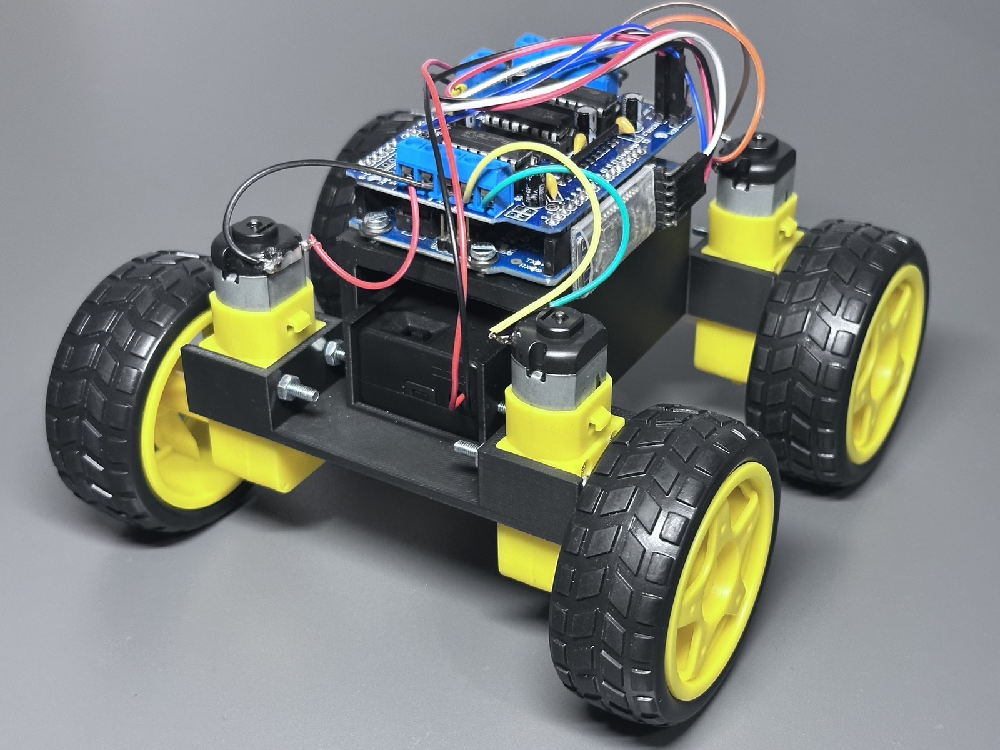
</p>

**[⬇ Version 3.4 herunterladen](https://github.com/brutterm-gif/mindflex-bci-car/releases/latest)** ·
[Teileliste](docs/TEILELISTE.md) · [Schaltplan](docs/images/wiring.svg) ·
[Architektur](docs/ARCHITEKTUR.md)

## Screenshots

Live-Vorhersage mit EEG-Verlauf, eSense-Werten, Fahrbefehl und Modellgenauigkeit:

| FORWARD | STOP |
|---|---|
| 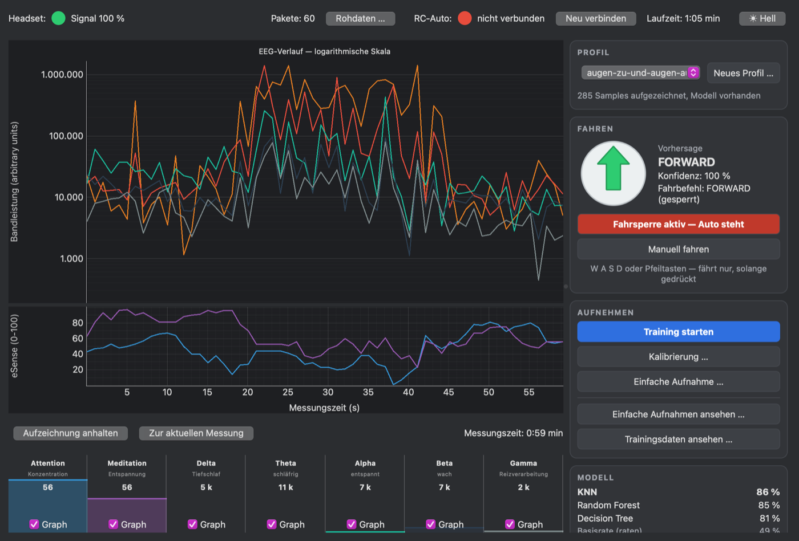 | 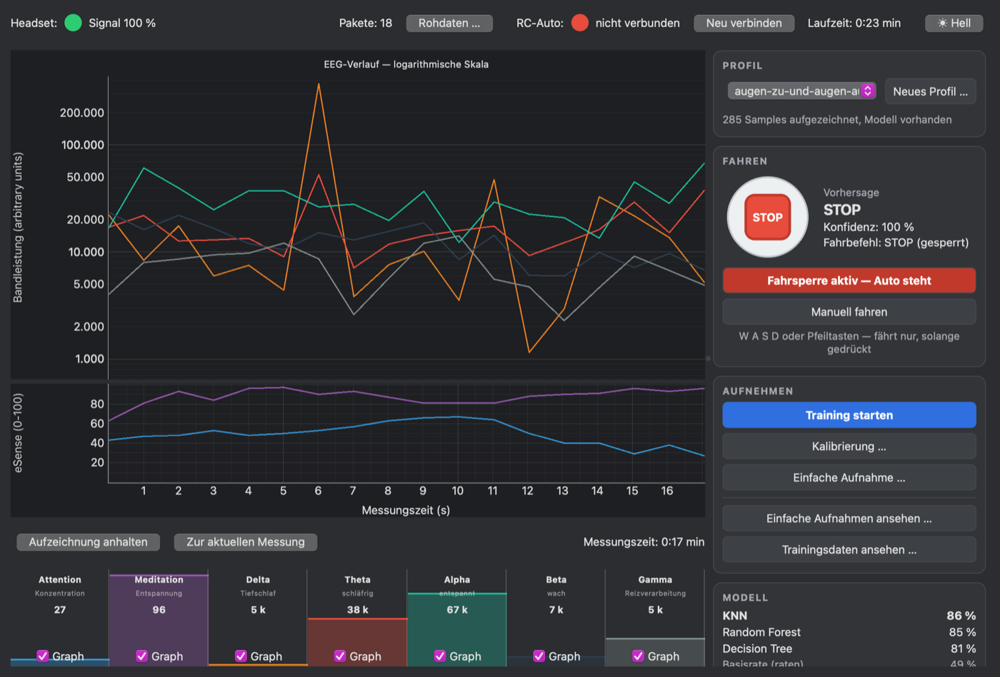 |

| Kalibrierung | Verwechslungsmatrix |
|---|---|
| 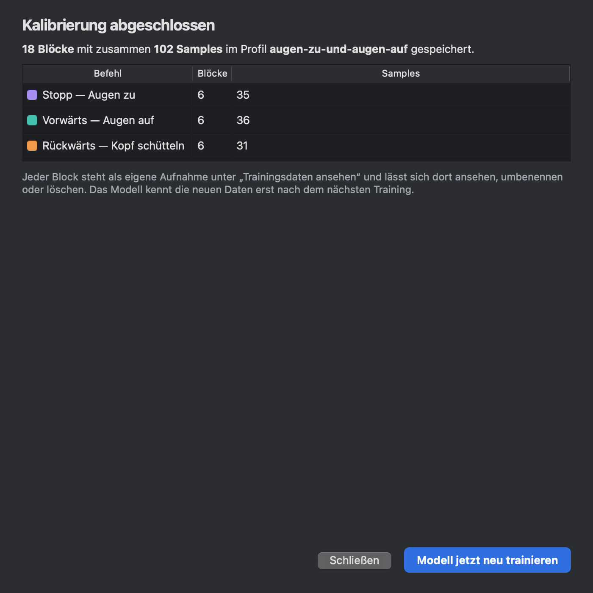 | 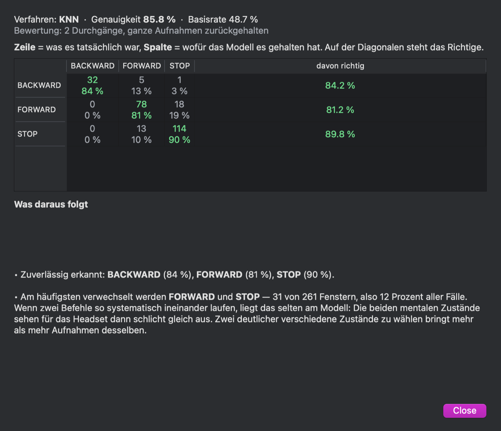 |

<details>
<summary><b>Weitere Screenshots</b></summary>

| Vorhersage BACKWARD | Auto verbunden, Fahrsperre aus |
|---|---|
| 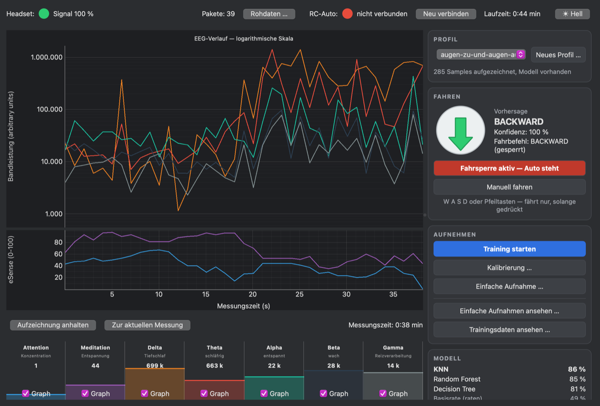 | 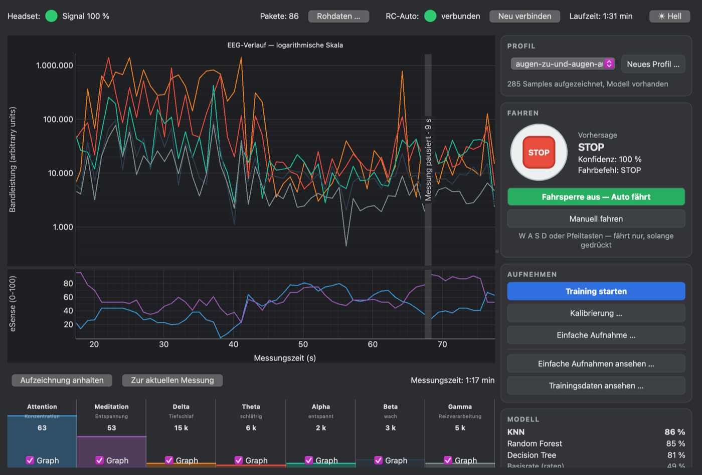 |

| Handbetrieb (W A S D) | Headset ohne Hautkontakt |
|---|---|
| 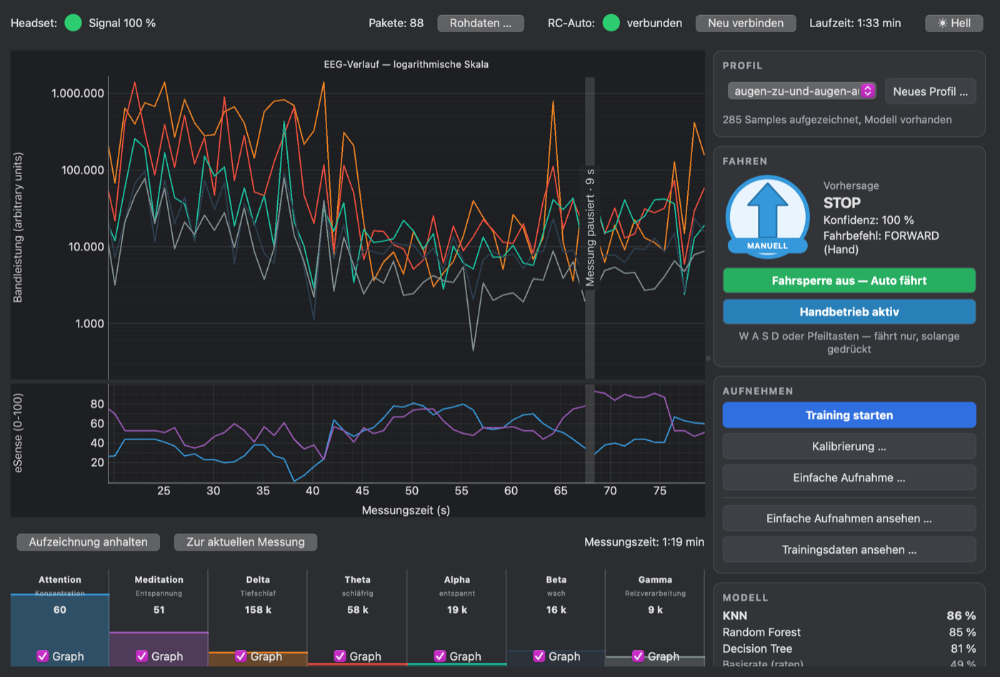 | 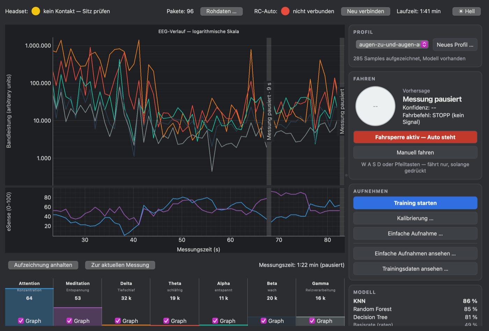 |

| Kalibrierung läuft | Helle Ansicht |
|---|---|
| 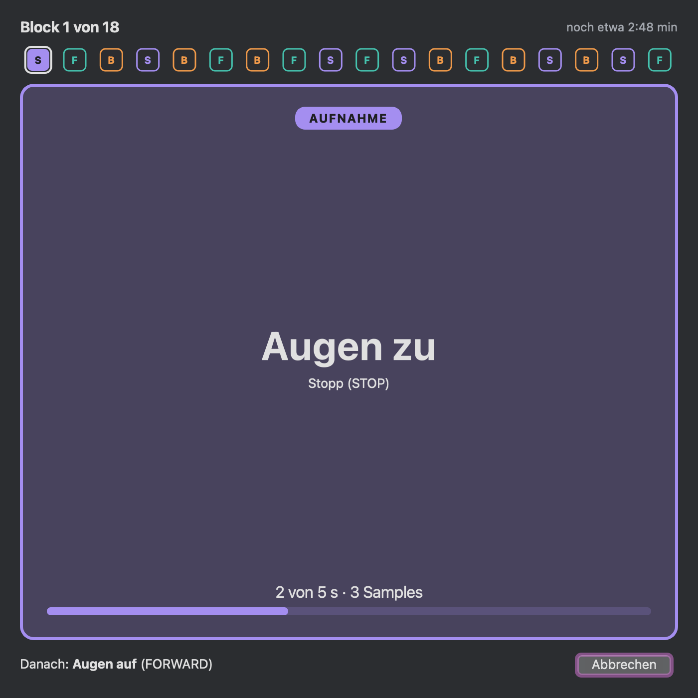 | 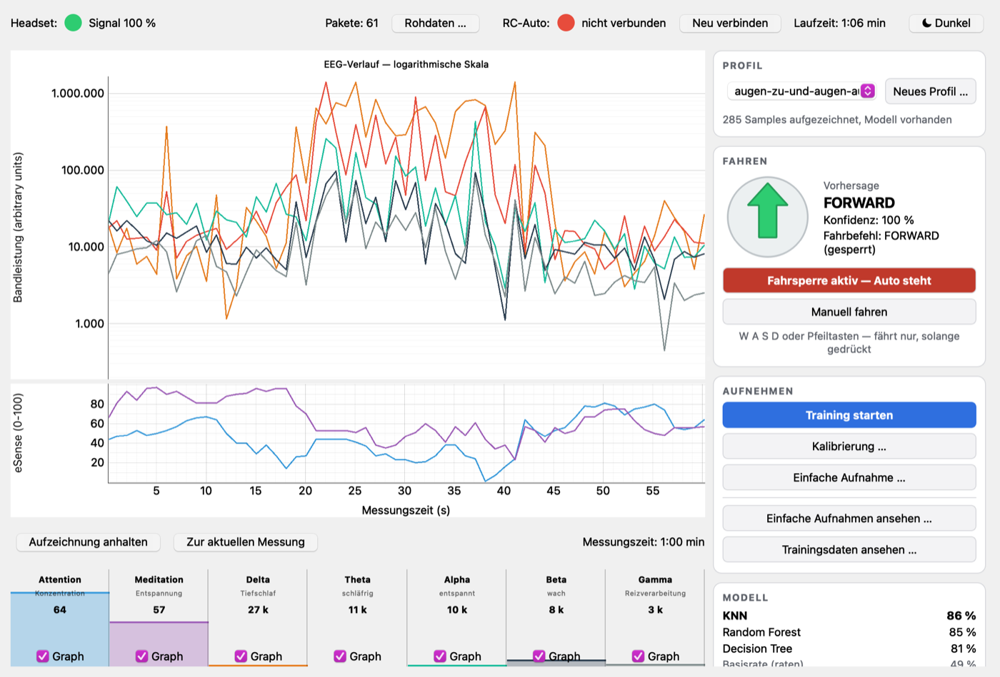 |

| Trainingsdaten mit Empfehlungen | Einzelne Aufnahme im Graphen |
|---|---|
| 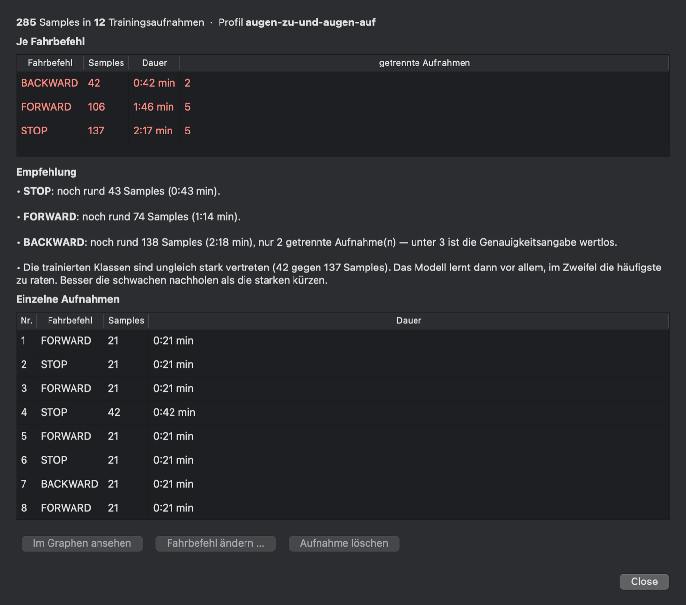 | 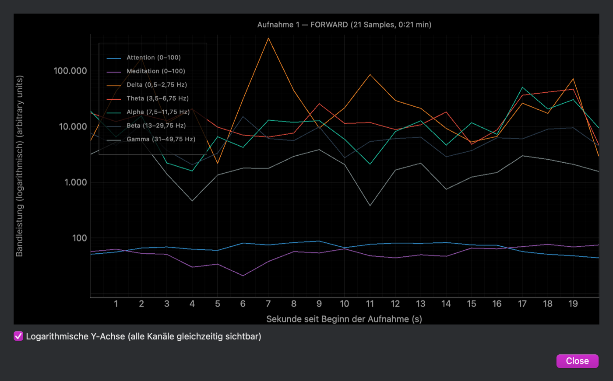 |

</details>

## Ergebnisse

Das Headset misst mit einer einzigen Elektrode auf der Stirn. Zuverlässig unterscheiden lassen
sich damit Zustände, die sich dort deutlich zeigen – nicht „Gedanken an links oder rechts“.
Gesteuert wird deshalb über drei bewusst erzeugbare Zustände:

| Befehl | Was man tut | Warum es funktioniert |
|---|---|---|
| STOP | Augen zu | Alpha-Wellen steigen deutlich an (Berger-Effekt) |
| FORWARD | Augen auf | Alpha fällt wieder ab |
| BACKWARD | Kopf schütteln oder Kiefer zusammenbeißen | Muskelsignal, das die Stirnelektrode mitmisst |

**Genauigkeit** (ein Profil, drei Befehle, 12 Aufnahmen mit zusammen 285 Sekunden, bewertet
mit zurückgehaltenen ganzen Aufnahmen):

| Verfahren | Genauigkeit |
|---|---|
| k-nächste Nachbarn | **85,8 %** |
| Random Forest | 85 % |
| Entscheidungsbaum | 81 % |
| Basisrate (immer die häufigste Klasse raten) | 48,7 % |

Richtig erkannt wurden STOP zu 90 %, BACKWARD zu 84 % und FORWARD zu 81 %. Am häufigsten
verwechselt werden FORWARD und STOP – vor allem kurz nach dem Augenöffnen, weil Alpha erst nach
2–3 Sekunden abfällt.

**Wie es dazu kam:**

- **20.08.2026 – scheinbar 100 %.** Die Zahl war ein Fehler: doppelt gespeicherte Zeilen und
  ein Zufallssplit über sich überlappende Fenster. Seitdem wird mit ganzen, zurückgehaltenen
  Aufnahmen bewertet und immer die Basisrate danebengestellt.
- **22.08.2026 – 64,6 %** (Random Forest) gegenüber 52,6 % Basisrate mit STOP, FORWARD und LEFT.
  Die Verwechslungsmatrix zeigte, dass LEFT systematisch mit FORWARD verwechselt wurde – die
  Stirnelektrode sieht den motorischen Kortex nicht. LEFT wurde gestrichen.
- **27.09.2026 – Blindtest zum Berger-Effekt.** Aus dem EEG allein ließ sich für 94,3 % der
  Sekunden richtig ablesen, ob die Augen offen oder geschlossen waren; Alpha war bei
  geschlossenen Augen dreimal so hoch.
- **Danach** kam BACKWARD über ein Muskelsignal dazu – das ergab die Werte oben.

Die Zahlen gelten für eine Person und eine kleine Datenmenge. Für BACKWARD gab es erst zwei
getrennte Aufnahmen; das Programm weist selbst darauf hin, dass die Angabe für diesen Befehl
damit noch unsicher ist. Modelle lassen sich nicht auf andere Personen übertragen; jede Person
braucht ihr eigenes Profil.

## Projektstruktur

```
MindFlex_BCI_Projekt/   Python-Anwendung: Empfang (USB/BLE), Feature-Extraktion, Training
                        und Klassifikation (KNN, Random Forest, Decision Tree), PyQt5-GUI
                        mit Kalibrierung, Profilen, Fahrsperre und Handbetrieb, Autosteuerung
  arduino/              Sketches für den EEG-Arduino und das RC-Auto
BrainGrapher/           Processing-Sketch zur Live-Visualisierung der rohen EEG-Werte,
                        erweitert um eine Bluetooth-Brücke (ble_bridge.py)
BrainGrapher_Python/    Nachbau des BrainGraphers in Python (PyQt5/pyqtgraph)
hardware/               3D-Modell des Chassis (STL)
docs/                   Architektur, Teileliste, Abbildungen
```

## Herkunft und eigener Anteil

`BrainGrapher/` basiert auf dem quelloffenen
[Processing-Brain-Grapher](https://github.com/kitschpatrol/Processing-Brain-Grapher) von
Eric Mika (MIT-Lizenz, siehe [`BrainGrapher/LICENSE.txt`](BrainGrapher/LICENSE.txt)). Er
diente als Ausgangspunkt, um die Rohdaten des MindFlex-Headsets zuverlässig zu empfangen und
sichtbar zu machen. Ergänzt wurde die Anbindung per Bluetooth LE. `BrainGrapher_Python/`
ist eine Übertragung dieses Sketches nach Python.

Der Sketch `mindflex_eeg.ino` beruht auf dem Beispiel *BrainSerialTest* der
[Arduino Brain Library](https://github.com/kitschpatrol/Brain), ebenfalls von Eric Mika.

`MindFlex_BCI_Projekt/` ist eine eigene Neuentwicklung: die Datenverarbeitungs-Pipeline
(Validierung, Ringpuffer, Feature-Extraktion), das Trainings- und Klassifikationssystem mit
automatischer Auswahl des besten Modells, die Oberfläche mit Kalibrierung und Profilen, die
Bluetooth-Anbindung sowie die Ansteuerung des RC-Autos. Ebenso eigen sind der Sketch
`rc_car_4wd.ino` und das Chassis.

## Hardware-Aufbau

Alle Bauteile: [Teileliste](docs/TEILELISTE.md). Verkabelung:

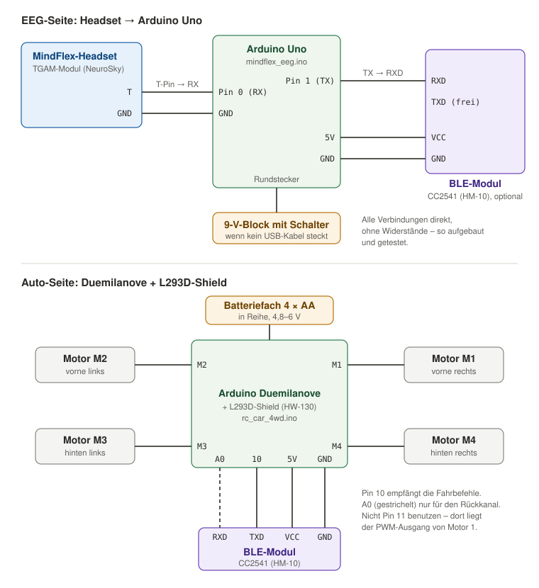

1. **Headset und EEG-Arduino (Uno):** Im MindFlex steckt das TGAM-Modul von NeuroSky. An
   dessen T-Pin und GND sind zwei Drähte angelötet, die zum Arduino führen. Mit der
   [Arduino Brain Library](https://github.com/kitschpatrol/Brain) gibt der Uno jede Sekunde eine
   CSV-Zeile aus (SignalQuality, Attention, Meditation, Delta, Theta, LowAlpha, HighAlpha,
   LowBeta, HighBeta, LowGamma, HighGamma) – über USB oder ein BLE-Modul. Arduino und
   Funkmodul sitzen direkt am Headset, ein 9-V-Block mit Schalter versorgt sie.

| Headset mit Arduino | Vorderansicht |
|---|---|
| 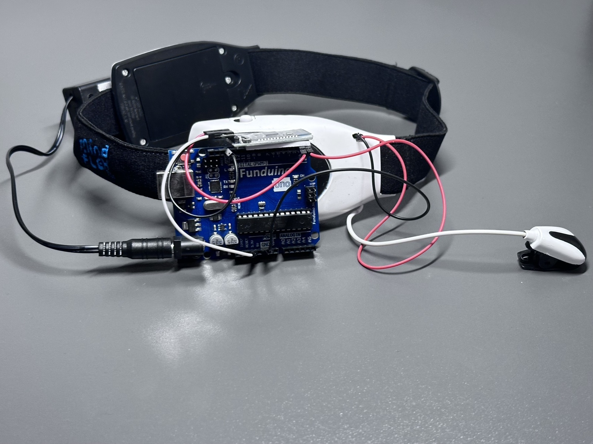 |  |
| **Geöffnet: TGAM-Modul mit angelöteten Drähten** | **Rückseite: 9-V-Block und Ohrclip** |
| 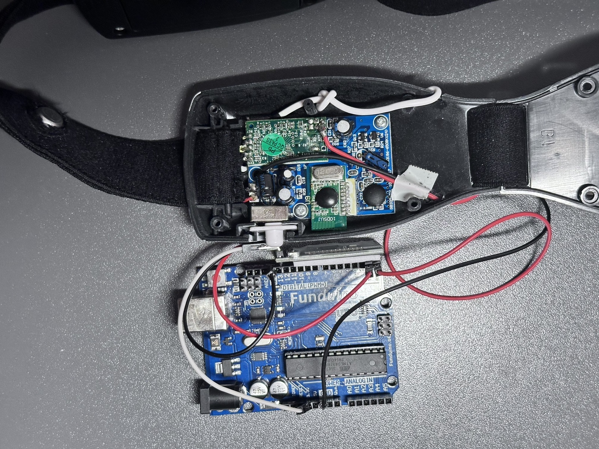 | 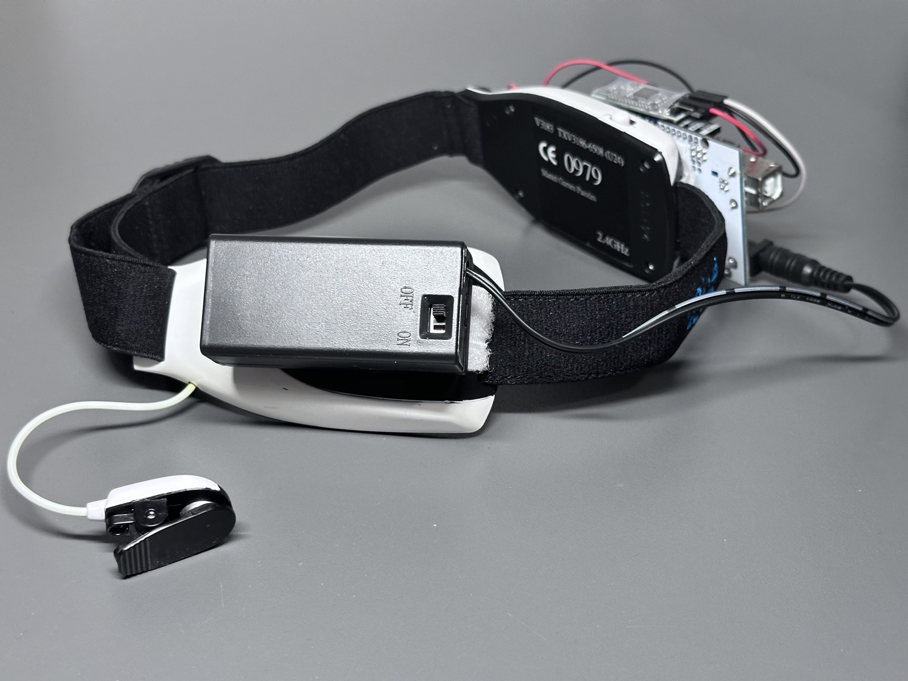 |

2. **RC-Auto (Arduino Duemilanove):** empfängt per Bluetooth LE Einzelzeichen-Befehle
   (`F`/`B`/`L`/`R`/`S`) und steuert über ein L293D-Motor-Shield vier Motoren an. Gelenkt
   wird wie bei einem Panzer: Zum Drehen laufen die beiden Seiten gegenläufig. Strom liefert
   ein 9-V-Block, der im Chassis unter dem Arduino sitzt.

| Seite mit 9-V-Block | Von oben | Seite mit USB-Anschluss |
|---|---|---|
|  | 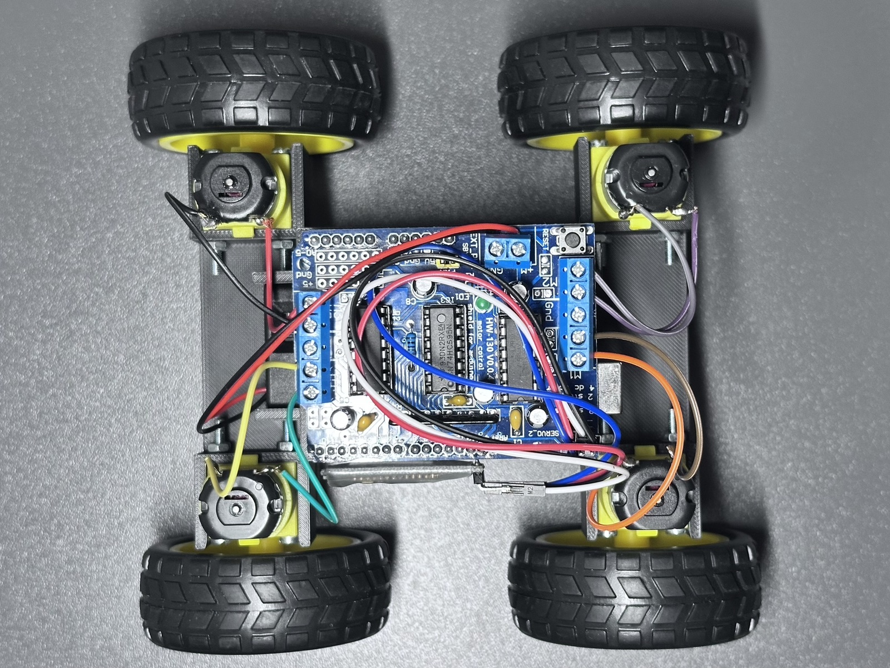 |  |

| Chassis | Technische Zeichnung |
|---|---|
|  |  |

Das Chassis liegt als [`hardware/chassis_car.stl`](hardware/chassis_car.stl) bei und kann
direkt gedruckt werden.

## Schnellstart

**Voraussetzungen:** Python 3.12, die [Arduino IDE](https://www.arduino.cc/en/software) mit
der [Arduino Brain Library](https://github.com/kitschpatrol/Brain) und der Adafruit Motor
Shield Library v1, optional [Processing](https://processing.org/download) für den
`BrainGrapher/`.

1. `MindFlex_BCI_Projekt/arduino/mindflex_eeg/mindflex_eeg.ino` auf den EEG-Arduino und
   `MindFlex_BCI_Projekt/arduino/rc_car_4wd/rc_car_4wd.ino` auf den Auto-Arduino hochladen.
2. Python-Anwendung starten:

```bash
cd MindFlex_BCI_Projekt
pip install -r requirements.txt
python main.py
```

Auf dem Mac geht auch ein Doppelklick auf `start.command`, unter Windows auf `start.bat`.
Bluetooth einrichten, Profil anlegen, kalibrieren:
[`MindFlex_BCI_Projekt/README.md`](MindFlex_BCI_Projekt/README.md).

Für die reine Signal-Visualisierung ohne Klassifikation: `BrainGrapher/BrainGrapher.pde` in
der Processing IDE öffnen (benötigt die Bibliothek ControlP5, installierbar über
*Sketch → Bibliothek importieren → Bibliothek hinzufügen*).

## Ablauf

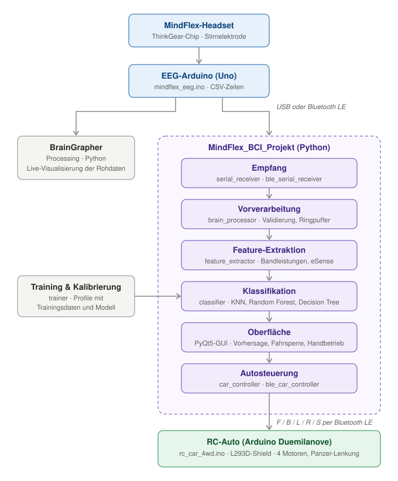

## Datenschutz

Trainingsprofile und EEG-Aufnahmen von Versuchspersonen sind nicht Teil dieses Repos. Jede
Person legt in der Oberfläche ein eigenes Profil an und kalibriert es; die Daten bleiben lokal
im Ordner `profile/`.

## Lizenz

- `MindFlex_BCI_Projekt/`, `hardware/`, `docs/`: MIT, siehe [`LICENSE`](LICENSE)
- `BrainGrapher/`, `BrainGrapher_Python/`: MIT, Copyright (c) 2010-2025 Eric Mika, siehe
  [`BrainGrapher/LICENSE.txt`](BrainGrapher/LICENSE.txt); Erweiterungen MIT, siehe [`LICENSE`](LICENSE)
