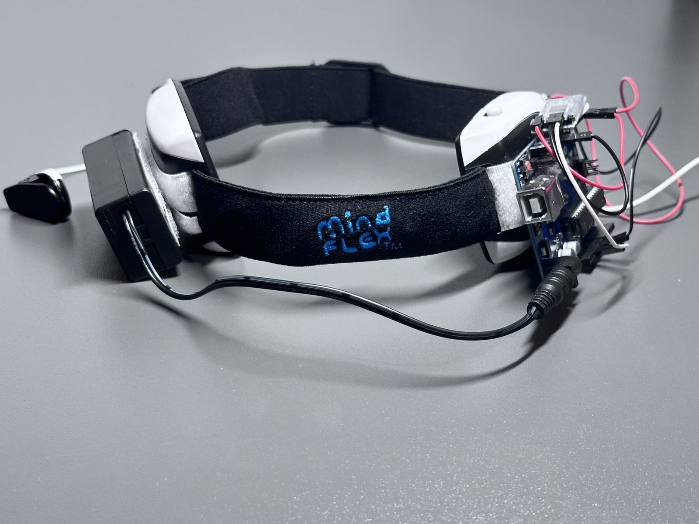
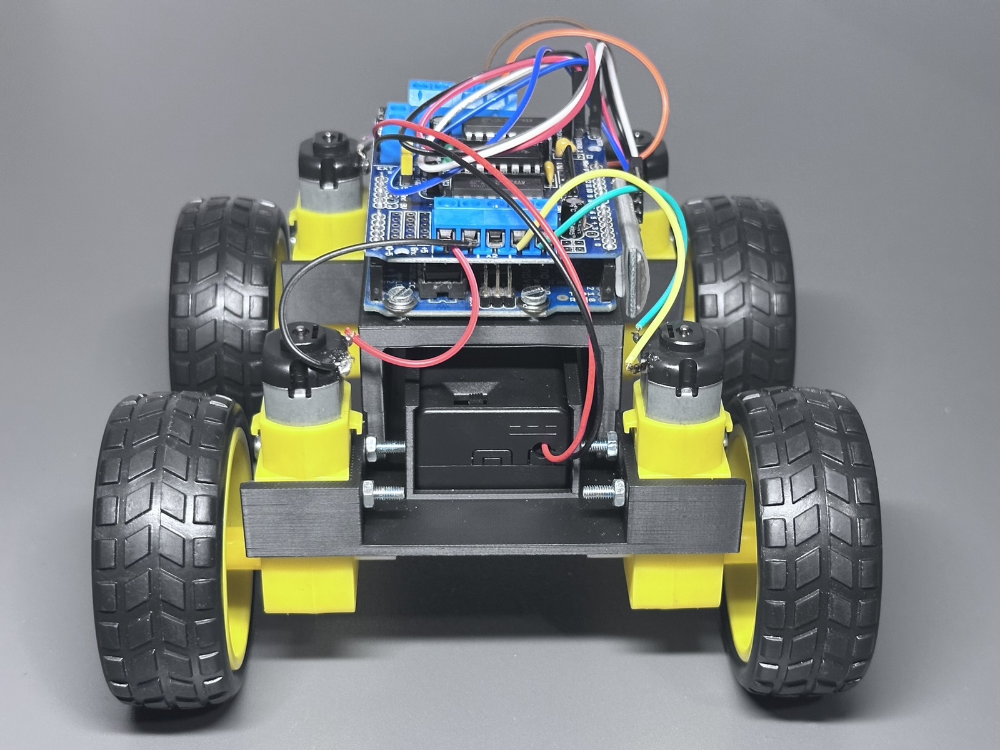
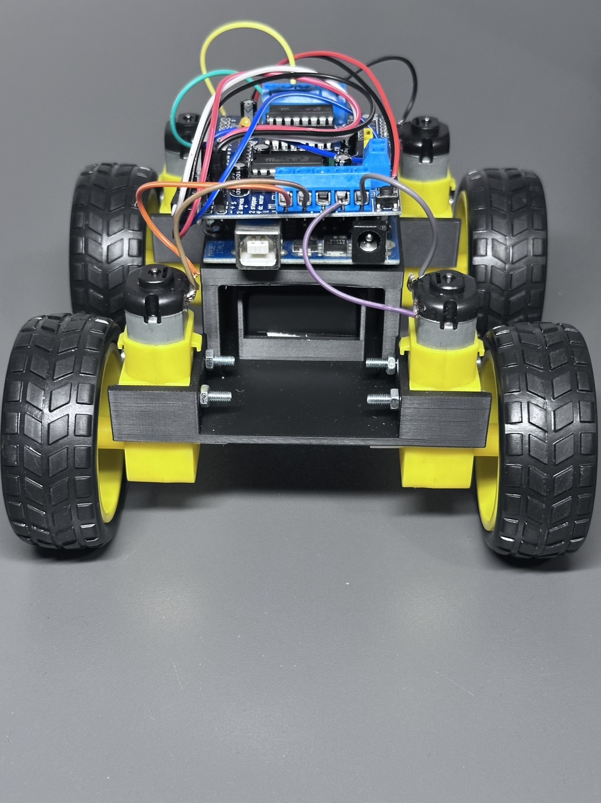
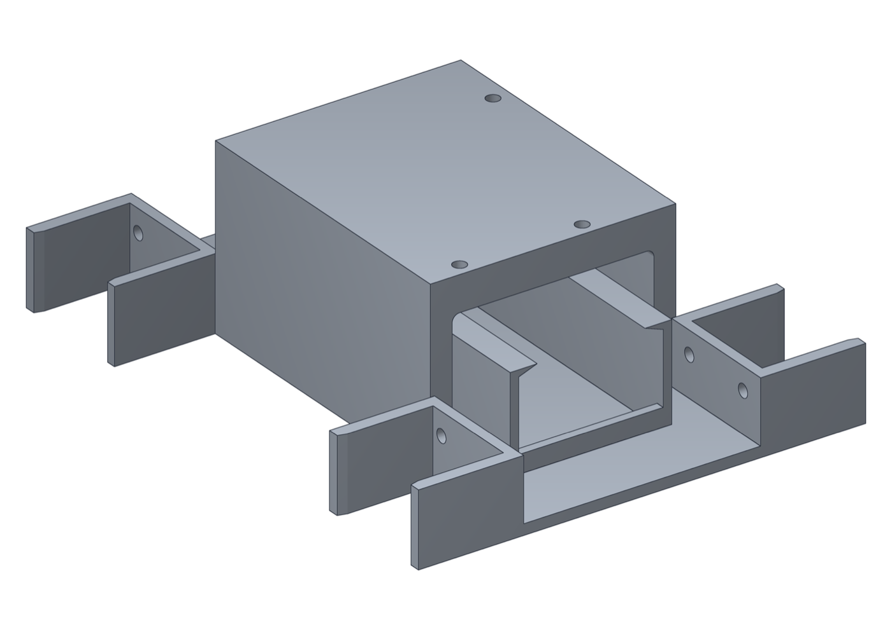
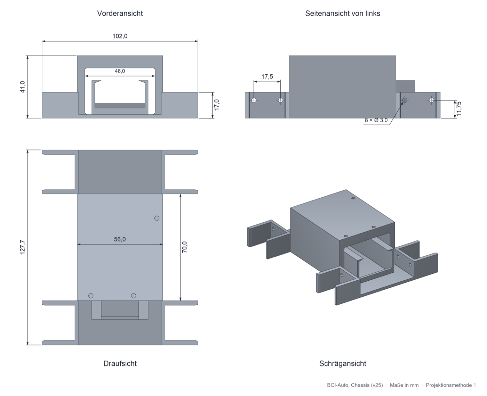
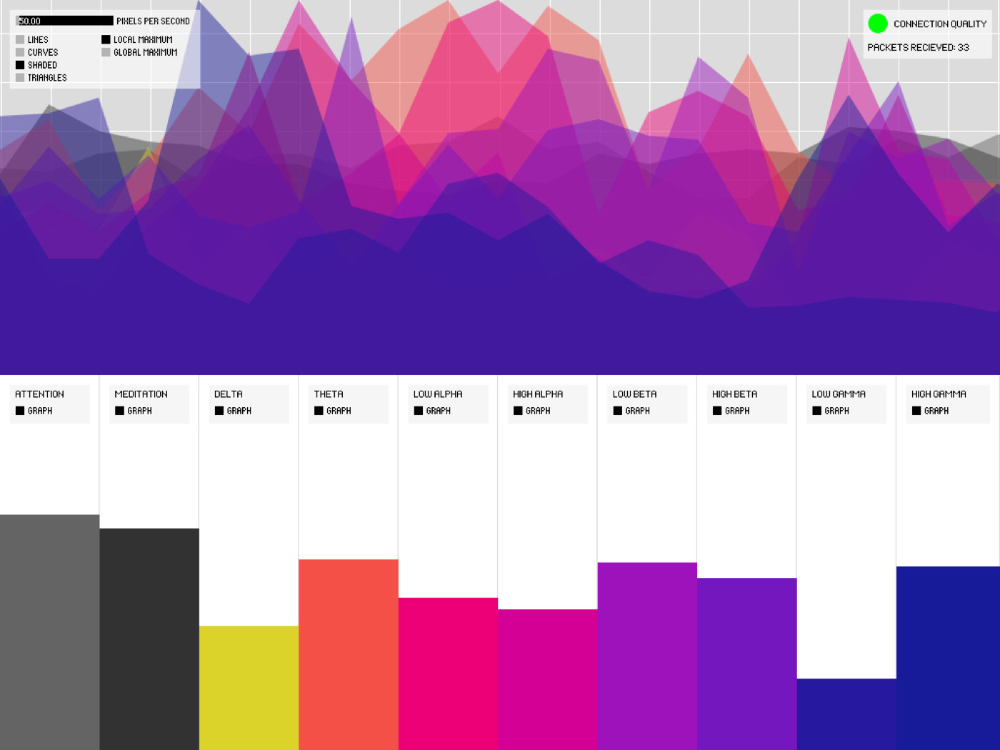

# MindFlex BCI – EEG-gesteuertes RC-Auto

Ein Brain-Computer-Interface-Projekt: Ein umgebautes MindFlex-EEG-Headset (ThinkGear-Chip)
liefert über einen Arduino seine Messwerte – per USB-Kabel oder kabellos über Bluetooth LE.
Eine Python-Anwendung wertet die Signale in Echtzeit aus, lernt aus Trainingsaufnahmen
mehrere Machine-Learning-Modelle an und setzt deren Vorhersagen in Fahrbefehle für ein
selbst konstruiertes, 3D-gedrucktes RC-Auto mit vier Motoren um.

Entstanden als praktischer Teil einer Seminarfacharbeit zum Thema
*„Brain-Computer-Interfaces – Wie Gedanken Maschinen steuern“*.

<p align="center">
  
</p>

## Screenshots

Live-Vorhersage mit EEG-Verlauf, eSense-Werten, Fahrbefehl und Modellgenauigkeit:

| FORWARD | STOP |
|---|---|
|  |  |

| Kalibrierung | Verwechslungsmatrix |
|---|---|
|  |  |

<details>
<summary><b>Weitere Screenshots</b></summary>

| Vorhersage BACKWARD | Auto verbunden, Fahrsperre aus |
|---|---|
|  |  |

| Handbetrieb (W A S D) | Headset ohne Hautkontakt |
|---|---|
|  |  |

| Kalibrierung läuft | Helle Ansicht |
|---|---|
|  |  |

| Trainingsdaten mit Empfehlungen | Einzelne Aufnahme im Graphen |
|---|---|
|  |  |

</details>

## Projektstruktur

```
MindFlex_BCI_Projekt/   Python-Anwendung: Empfang (USB/BLE), Feature-Extraktion, Training
                        und Klassifikation (KNN, Random Forest, Decision Tree), PyQt5-GUI
                        mit Kalibrierung, Profilen, Fahrsperre und Handbetrieb, Autosteuerung
  arduino/              Sketches für den EEG-Arduino und das RC-Auto
BrainGrapher/           Processing-Sketch zur Live-Visualisierung der rohen EEG-Werte,
                        erweitert um eine Bluetooth-Brücke (ble_bridge.py)
BrainGrapher_Python/    Nachbau des BrainGraphers in Python (PyQt5/pyqtgraph)
hardware/               3D-Modell des Chassis (STL, Stand v25)
docs/                   Architektur-Dokumentation und Abbildungen
```

Die ausführliche Beschreibung aller Komponenten, Entscheidungen und Fehlerbilder steht in
[`docs/ARCHITEKTUR.md`](docs/ARCHITEKTUR.md).

## Herkunft und eigener Anteil

`BrainGrapher/` basiert auf dem quelloffenen
[Processing-Brain-Grapher](https://github.com/kitschpatrol/Processing-Brain-Grapher) von
Eric Mika (MIT-Lizenz, siehe [`BrainGrapher/LICENSE.txt`](BrainGrapher/LICENSE.txt)). Er
diente als Ausgangspunkt, um die Rohdaten des MindFlex-Headsets zuverlässig zu empfangen und
sichtbar zu machen. Ergänzt wurde die Anbindung per Bluetooth LE. `BrainGrapher_Python/`
ist eine Übertragung dieses Sketches nach Python.

Der Sketch `mindflex_eeg.ino` beruht auf dem Beispiel *BrainSerialTest* der
[Arduino Brain Library](https://github.com/kitschpatrol/Brain), ebenfalls von Eric Mika.

`MindFlex_BCI_Projekt/` ist eine eigene Neuentwicklung: die Datenverarbeitungs-Pipeline
(Validierung, Ringpuffer, Feature-Extraktion), das Trainings- und Klassifikationssystem mit
automatischer Auswahl des besten Modells, die Oberfläche mit Kalibrierung und Profilen, die
Bluetooth-Anbindung sowie die Ansteuerung des RC-Autos. Ebenso eigen sind der Sketch
`rc_car_4wd.ino` und das Chassis.

## Hardware-Aufbau

1. **EEG-Arduino (Uno):** Der T-Pin des ThinkGear-Chips im MindFlex-Headset hängt am
   Arduino. Mit der [Arduino Brain Library](https://github.com/kitschpatrol/Brain) gibt er
   jede Sekunde eine CSV-Zeile aus (SignalQuality, Attention, Meditation, Delta, Theta,
   LowAlpha, HighAlpha, LowBeta, HighBeta, LowGamma, HighGamma) – über USB oder ein
   BLE-Modul. Arduino und Funkmodul sitzen direkt am Headset, eine eigene
   Batteriebox versorgt sie.

| Headset mit Arduino | Seitenansicht |
|---|---|
|  |  |
| **Geöffnet: Abgriff am ThinkGear-Chip** | **Rückseite mit Batteriebox** |
|  |  |

2. **RC-Auto (Arduino Duemilanove):** empfängt per Bluetooth LE Einzelzeichen-Befehle
   (`F`/`B`/`L`/`R`/`S`) und steuert über ein L293D-Motor-Shield vier Motoren an. Gelenkt
   wird wie bei einem Panzer: Zum Drehen laufen die beiden Seiten gegenläufig.

| Von vorn | Von oben | Von hinten |
|---|---|---|
|  |  |  |

| Chassis (v25) | Technische Zeichnung |
|---|---|
|  |  |

Das Chassis liegt als [`hardware/chassis_car.stl`](hardware/chassis_car.stl) bei und kann
direkt gedruckt werden.

## Schnellstart

**Voraussetzungen:** Python 3.12, die [Arduino IDE](https://www.arduino.cc/en/software) mit
der [Arduino Brain Library](https://github.com/kitschpatrol/Brain) für den EEG-Arduino und
optional [Processing](https://processing.org/download) für den `BrainGrapher/`.

1. `MindFlex_BCI_Projekt/arduino/mindflex_eeg/mindflex_eeg.ino` auf den EEG-Arduino und
   `MindFlex_BCI_Projekt/arduino/rc_car_4wd/rc_car_4wd.ino` auf den Auto-Arduino hochladen.
2. Python-Anwendung starten:

```bash
cd MindFlex_BCI_Projekt
pip install -r requirements.txt
python main.py
```

Auf dem Mac geht auch ein Doppelklick auf `start.command`, unter Windows auf `start.bat`.
Ausführliche Anleitung mit Port-Konfiguration und Trainingsmodus:
[`MindFlex_BCI_Projekt/START_HIER.md`](MindFlex_BCI_Projekt/START_HIER.md) und
[`MindFlex_BCI_Projekt/README.md`](MindFlex_BCI_Projekt/README.md).

Für die reine Signal-Visualisierung ohne Klassifikation: `BrainGrapher/BrainGrapher.pde` in
der Processing IDE öffnen (benötigt die Bibliothek ControlP5, installierbar über
*Sketch → Bibliothek importieren → Bibliothek hinzufügen*).

## Ablauf




## Datenschutz

Trainingsprofile und EEG-Aufnahmen von Versuchspersonen sind nicht Teil dieses Repos.
Das mitgelieferte `trained_model.pkl` dient nur als Startpunkt; für brauchbare Ergebnisse
sollte jede Person über *Kalibrierung* ein eigenes Profil anlegen.

## Lizenz

- `MindFlex_BCI_Projekt/`, `hardware/`, `docs/`: MIT, siehe [`LICENSE`](LICENSE)
- `BrainGrapher/`, `BrainGrapher_Python/`: MIT, Copyright (c) 2010-2025 Eric Mika, siehe
  [`BrainGrapher/LICENSE.txt`](BrainGrapher/LICENSE.txt); Erweiterungen MIT, siehe [`LICENSE`](LICENSE)
